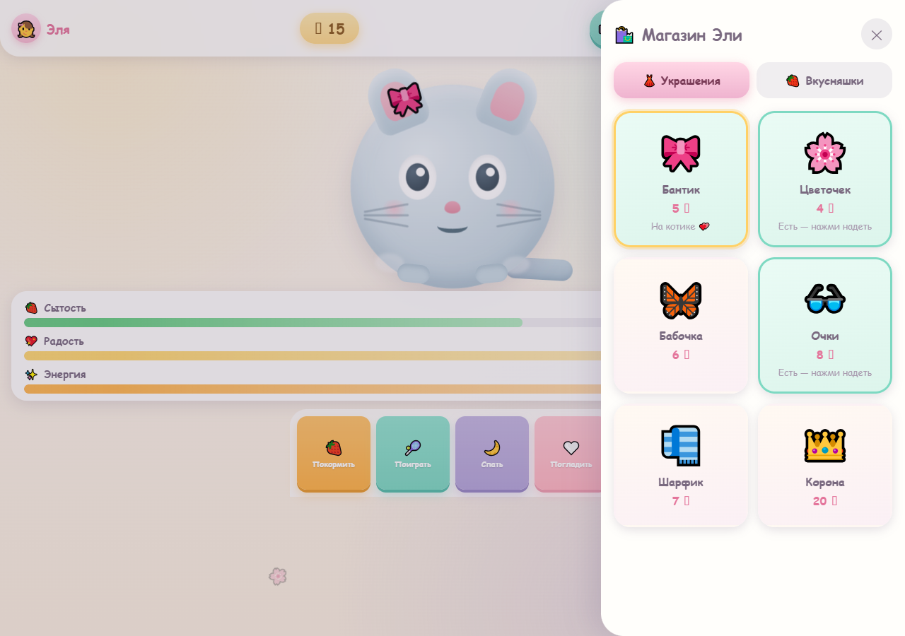
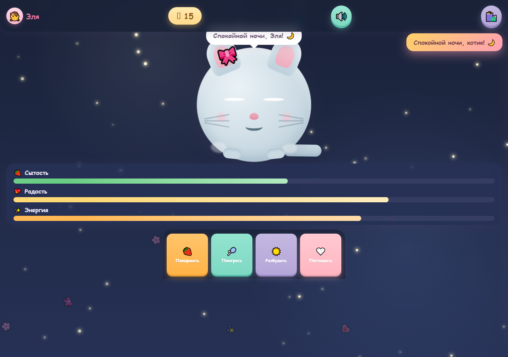
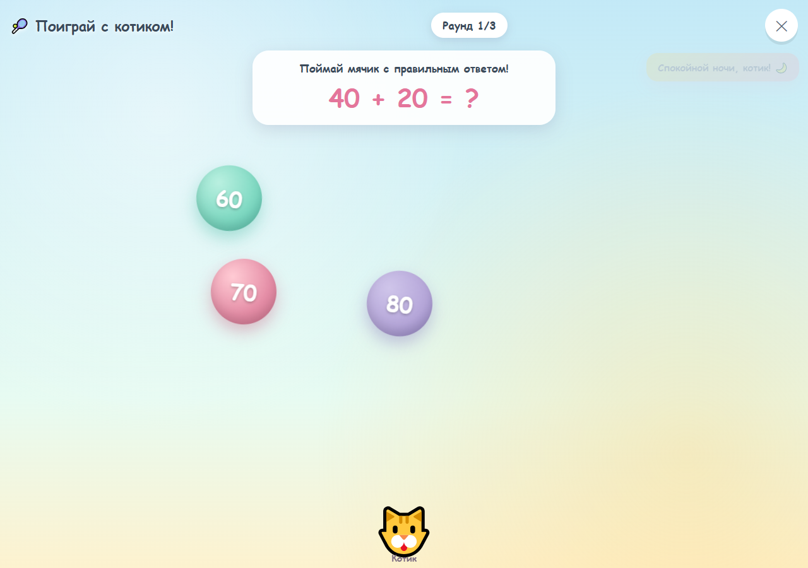
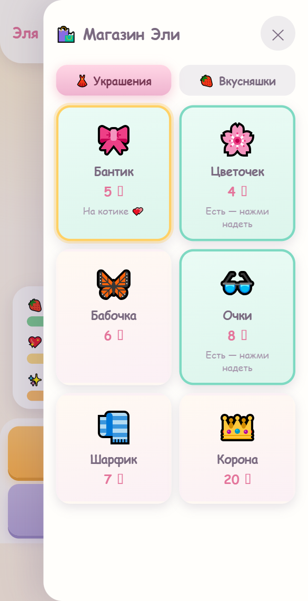

  

# Котик для Эли

Канбан-трекер для шестилетней девочки: забота о виртуальном котике в виде игры. Котёнок Эля живёт в браузере и не даст забыть покормить себя, поиграть и поспать.

**Играйте онлайн: <https://dmmshiryaev-bit.github.io/kotik-eli/>**

## Возможности

- Кормление вкусняшками: клубника, рыбка, кексик, молочко
- Игра за монетки и мини-игра «Поймай мячик» с правильными ответами
- Сон с ночным небом, звёздами и пробуждением-потягушками
- Поглаживания, сердечки и фразы котика
- Магазин украшений: бантик, цветочек, бабочка, очки, шарфик и корона
- Задачи на счёт с пучками морковок
- Полоски сытости, радости и энергии, дневной бонус и награды
- Озвучка фраз голосом браузера и мурлыканье котика
- Прогресс сохраняется в браузере (localStorage)

## Скриншоты

| Главный экран | Учимся считать | Покормить котика |
|---|---|---|
|  |  |  |

| Магазин | Ночной сон | Мини-игра |
|---|---|---|
|  |  |  |

| Мобильная версия |
|---|
|  |

## Запуск локально

Просто откройте `index.html` в браузере. Рядом с ним должен лежать файл звука `Zvuki_prirody_-_murchanie_koshki_63222271.mp3` — мурлыканье котика.

## Технологии

Один файл `index.html` со встроенными CSS и JavaScript. Без зависимостей и сервера: Web Speech API для озвучки, Web Audio API для звуковых эффектов, localStorage для сохранения.